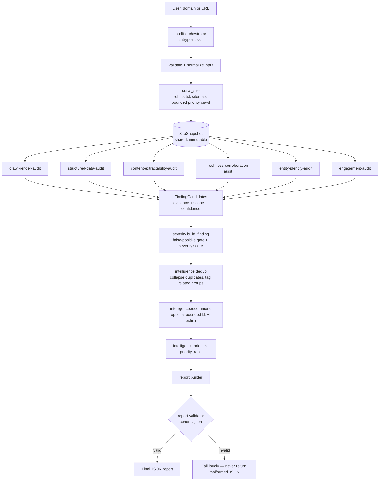

# Brand AI-Readiness Audit — Agent Skill Marketplace

An Agent Skill Marketplace, built for Adobe University Hackathon 2026 (Round 3),
that audits how discoverable, machine-readable, and engaging a website is for
AI agents and answer engines — and returns one evidence-backed JSON report.

```bash
python skills/audit-orchestrator/scripts/run_audit.py example.com
```

## What each skill does, and how the entrypoint composes them

`audit-orchestrator` is the marketplace's **only entrypoint**. Given a
domain or URL it validates the input, runs one bounded read-only crawl, and
hands the resulting `SiteSnapshot` to six specialized audit skills — each
invoked in-process against that *same* snapshot, so nothing crawls the site
twice:

| Skill | What it checks |
|---|---|
| `crawl-render-audit` | robots.txt, sitemap, canonical hygiene, broken links, JS-dependent content |
| `structured-data-audit` | JSON-LD/Microdata/RDFa coverage, correctness, consistency with visible content |
| `content-extractability-audit` | Can a machine answer who/what/who-for/where from extractable text |
| `freshness-corroboration-audit` | Date signals, staleness, cross-page fact consistency |
| `entity-identity-audit` | One unambiguous brand identity, or several an AI could confuse |
| `engagement-audit` | Orientation, next-action, internal-linking health |

Every skill's raw findings then go to `recommendation-engine`, which
deduplicates by root cause, optionally polishes wording via a bounded LLM
call, prioritizes, and assembles + validates the one final JSON report
against `audit_engine/report/schema.json` — failing loudly rather than ever
returning malformed JSON. Every skill can also run standalone
(`analyze.py --url <site>`); see §3 and §13 below for exact invocation.

The sections below go deeper — full architecture, data flow, severity
model, evidence model, and usage — for anyone auditing the implementation
itself, not just what it does.

## 1. Problem

AI agents and answer engines now read websites on behalf of users — to
answer "what does this company sell", "where are they located", "is this
still the current price" — without a human in the loop to forgive an
ambiguous page or wait for a JavaScript bundle to load. Most sites are still
built for a browser and a human. This project audits that gap: not
traditional SEO, but whether a machine can reliably *extract facts* from a
site and whether the site *engages* an agentic visitor once it lands.

## 2. Architecture



`audit_engine/` is the shared Python library every skill's script imports —
crawler, parsers, six analyzers, and the severity/dedup/recommend/prioritize
"intelligence" layer. `skills/*/SKILL.md` is the Agent Skills-format
documentation layer that tells an LLM agent (or a human) when and how to
invoke each piece. Neither layer duplicates the other: the library holds all
logic; the skills hold all instructions.

## 3. Skill marketplace

| Skill | Role |
|---|---|
| **`audit-orchestrator`** *(entrypoint)* | Validates input, runs the crawl once, invokes the six specialized skills, assembles and validates the final report. Contains no domain-specific audit logic itself. |
| `crawl-render-audit` | robots.txt, sitemap, canonical hygiene, broken links, JS-dependent content |
| `structured-data-audit` | JSON-LD/Microdata/RDFa coverage, correctness, consistency with visible content |
| `content-extractability-audit` | Can a machine answer who/what/who-for/where from extractable text |
| `freshness-corroboration-audit` | Date signals, staleness, cross-page fact consistency |
| `entity-identity-audit` | One unambiguous brand identity, or several an AI could confuse |
| `engagement-audit` | Orientation, next-action, internal-linking health |
| `recommendation-engine` | Dedup by root cause, optional LLM recommendation polish, prioritization, final assembly |

Eight skills, each a genuine separation of concern — not padding. Every
skill can run standalone (`analyze.py --url <site>`) or as part of the
single-shot pipeline the entrypoint runs by default. See `marketplace.json`
for the manifest and `scripts/validate_marketplace.py` for compliance
checks (exactly one entrypoint, every `SKILL.md` has valid frontmatter, no
orphaned skill directories).

## 4. Data flow

```
AuditRequest -> SiteSnapshot (pages: PageSnapshot[]) -> Evidence[] -> FindingCandidate[]
             -> Finding[] (severity-scored, evidence-backed) -> AuditResult -> report dict
```

All typed as dataclasses in `audit_engine/models.py` — no analyzer passes
around an untyped dict internally. Only at the very last step
(`AuditResult.to_report_dict()`) does the internal representation flatten
into the exact JSON shape the spec mandates.

## 5. Audit methodology

**Deterministic first, LLM only for synthesis.** Every fact (HTTP status,
JSON-LD validity, heading levels, word counts, link graphs, date parsing,
contact-info regexes) is computed with plain code in `audit_engine/crawler/`
and `audit_engine/parsing/`. The *only* place an LLM call is allowed
(`audit_engine/intelligence/llm_interpret.py`) rephrases an already-evidenced
recommendation — it cannot invent a finding, and it's used for at most 8
findings per audit to bound cost and latency. Without `ANTHROPIC_API_KEY`
set, the entire pipeline runs deterministically and produces an equally
schema-valid report (the `limitations` array says so explicitly).

Six analyzers cover: crawlability/render, structured data, content
extractability, freshness/corroboration, entity identity, and engagement —
see each skill's `SKILL.md` and `references/checklist.md` for exact
thresholds. A `check_id` -> `CheckDefinition` catalog
(`audit_engine/catalog.py`) centralizes each check's `impact` and
`business_importance` so severity scoring is consistent across all six
analyzers instead of six copy-pasted scoring schemes.

## 6. Evidence model

```python
class Evidence:
    source_url: str
    signal: str              # machine-readable signal name
    observed_value: str      # what was actually observed, quantified where possible
    expected_value: str | None
    confidence: float        # 0..1
```

Every `Finding` requires at least one `Evidence` entry
(`severity.build_finding` rejects candidates with none) and states a
quantified sample wherever scope matters — "0/12 product pages contain
Product/Offer JSON-LD", never "the website has no structured data". A
candidate whose `confidence` falls below `config.analysis.confidence_threshold`
(default 0.55) is dropped outright, and the crawl-render analyzer
short-circuits to one clear "site unreachable" finding when zero pages were
fetched, instead of letting every other check fire misleading noise on top
of a connectivity failure.

## 7. Severity model

```
composite = 0.35*impact + 0.25*scope + 0.20*confidence + 0.20*business_importance
```

`impact` and `business_importance` are static, per-check values from the
catalog (general principles, never tuned to a specific site — spec section
38: generalization). `scope` and `confidence` are computed at runtime from
the actual evidence. A weighted sum, not a product of four ≤1 numbers, so a
narrow-but-severe issue found with high confidence on a highly important
page isn't washed out by moderate scope. Thresholds: `≥0.75` critical,
`≥0.55` high, `≥0.35` medium, else low. See
`skills/recommendation-engine/references/recommendation-catalog.md` for the
full writeup, including the separate (also deterministic) priority-ranking
formula used only for ordering, not for the severity label itself.

## 8. Recommendation model

Every finding's `suggested_action` is specific and tied to its evidence —
"Add an Organization JSON-LD block to the homepage with the canonical brand
name, official URL, logo, and sameAs links..." never "improve SEO". Two
structured-data checks (`missing_faq_schema_opportunity`,
`missing_breadcrumb_schema`) and one entity check
(`weak_entity_sameas_linking`) are explicitly **proactive**
(`"proactive": true`) — suggestions for content that's already present but
unmarked, not defects.

## 9. Safety model

Strictly read-only. The crawler only ever issues GET/HEAD requests, respects
`robots.txt` by default, stays same-domain, and never submits a form, logs
in, or performs any state-changing action. Every network call is
individually bounded (`request_timeout_s`, `max_response_size_bytes`,
`max_redirects`) and a single page's failure (timeout, 404, malformed HTML,
SSL error, DNS failure) is caught and recorded, never allowed to crash the
audit — see the `try/except` around each analyzer call and each fetch in
`audit_engine/orchestrator.py` / `audit_engine/crawler/fetcher.py`.

## 10. Runtime optimization

- **One shared crawl.** Every analyzer consumes the same `SiteSnapshot`; none
  crawls independently (6x fewer requests than a naive per-skill crawl).
- **Bounded by default**: `max_pages=25`, `max_depth=3`, `overall_budget_s=150`,
  5 concurrent fetches — tunable in `config/default.yaml`, overridable via
  `BRAND_AUDIT__SECTION__KEY` env vars.
- **Priority-ordered crawl**, not naive BFS: URLs matching identity/commerce
  keywords (about, contact, pricing, product, ...) and sitemap-listed URLs
  are pulled forward, so a small page budget still samples the pages that
  carry signal on a large site.
- **Two-stage rendering**: a free static heuristic (`js_dependency_score`)
  runs on every page; a real Playwright render only runs — if Playwright is
  installed at all — on a handful of pages already flagged suspicious.
- Measured: **~0.6s** for a 1-page static site, **~4.5s** for a 25-page crawl
  of python.org, both dominated by network I/O, not analysis — comfortably
  under the 5-minute target with headroom for much larger sites.

## 11. Testing

```bash
pip install -r requirements-dev.txt
pytest
```

41 tests: unit tests for URL normalization, structured-data extraction
(JSON-LD/Microdata, including malformed-JSON repair), severity scoring,
deduplication semantics, HTML extraction, render heuristics, and report
schema validation; integration tests that spin up a real local HTTP server
over three fixture sites (`good_ecommerce` — should produce few, no-critical
findings; `spa_js_only` — should trip the JS-dependency check; `poorly_structured`
— should trip findings across ≥3 categories) plus an unreachable-domain case;
and a regression suite with one test per bug actually found while building
this (two same-site/scheme URL-handling bugs that only manifested once real
local-server fixtures were introduced — real evidence that the fixture-based
integration tests earn their keep).

```bash
python scripts/validate_marketplace.py   # marketplace.json + every SKILL.md
python scripts/validate_report.py <report.json>   # any report against the schema
```

## 12. Installation

```bash
python3 -m venv .venv
source .venv/bin/activate
pip install -r requirements.txt
```

Optional: `ANTHROPIC_API_KEY` for the LLM recommendation-polish layer;
`pip install playwright && playwright install chromium` for real render-delta
checks. Neither is required — the pipeline is fully functional and
schema-valid without either.

## 13. Usage

Activate the venv first, every session:

```bash
cd /Users/vijender/Documents/Adobe_Project
source .venv/bin/activate
```

### Run the full pipeline against any real site

```bash
python skills/audit-orchestrator/scripts/run_audit.py example.com
python skills/audit-orchestrator/scripts/run_audit.py https://example.com --out report.json
```

Progress logs go to stderr (`[CRAWLER]`, `[STRUCTURED-DATA-AUDIT]`, `[ORCHESTRATOR]`, ...);
stdout carries only the JSON report, so `... > report.json` gives clean JSON.

### Tune crawl size/time without editing config

Every value in `config/default.yaml` is overridable via
`BRAND_AUDIT__<SECTION>__<KEY>` env vars:

```bash
BRAND_AUDIT__CRAWL__MAX_PAGES=5 BRAND_AUDIT__CRAWL__OVERALL_BUDGET_S=30 \
    python skills/audit-orchestrator/scripts/run_audit.py example.com
```

### Run one specialized skill in isolation

```bash
python skills/structured-data-audit/scripts/analyze.py --url example.com
```

Every one of the six analyzer skills supports the same `--url` (standalone,
bounded crawl) / `--snapshot <file>` (shared-snapshot) flags — see each
skill's `SKILL.md`.

### Chain all 6 skills manually + assemble (proves the skill decomposition)

Shares one crawl across separate tool calls, the way an agent invoking each
skill independently would:

```bash
python skills/crawl-render-audit/scripts/analyze.py --url example.com --save-snapshot /tmp/snap.json
python skills/structured-data-audit/scripts/analyze.py --snapshot /tmp/snap.json > /tmp/sd.json
python skills/content-extractability-audit/scripts/analyze.py --snapshot /tmp/snap.json > /tmp/ce.json
python skills/freshness-corroboration-audit/scripts/analyze.py --snapshot /tmp/snap.json > /tmp/fr.json
python skills/entity-identity-audit/scripts/analyze.py --snapshot /tmp/snap.json > /tmp/ei.json
python skills/engagement-audit/scripts/analyze.py --snapshot /tmp/snap.json > /tmp/en.json
python skills/crawl-render-audit/scripts/analyze.py --snapshot /tmp/snap.json > /tmp/cr.json
python skills/recommendation-engine/scripts/assemble_report.py --site example.com \
    --findings /tmp/cr.json /tmp/sd.json /tmp/ce.json /tmp/fr.json /tmp/ei.json /tmp/en.json
```

### Validate structural compliance

```bash
python scripts/validate_marketplace.py         # marketplace.json + all 8 SKILL.md files
python scripts/validate_report.py report.json  # any report against the mandated schema
```

### Enable optional layers

```bash
# LLM recommendation polish (bounded to the top 8 findings by severity):
export ANTHROPIC_API_KEY=sk-...
python skills/audit-orchestrator/scripts/run_audit.py example.com

# Real render-delta checks (not installed by default):
pip install playwright && playwright install chromium
```

### Testing every use case, three ways

**A. The automated suite** — fastest, covers most cases in ~2 seconds, fully
offline (no real network calls):

```bash
pip install -r requirements-dev.txt
pytest tests/ -v
```

**B. Exercise one fixture "scenario" by hand and read the actual JSON** — each
fixture under `tests/fixtures/sites/` is a deliberately different situation:

| Fixture | What it proves |
|---|---|
| `good_ecommerce` | A well-built small site gets **zero critical findings** |
| `spa_js_only` | JS-dependent content gets flagged correctly (and only then) |
| `poorly_structured` | A genuinely bad site trips findings across many categories |
| `http://127.0.0.1:1/` (nothing listening) | Total failure -> exactly one clear finding, not noise |

```python
from pathlib import Path
from tests.integration.server import serve_fixture
from audit_engine.orchestrator import run_audit
from audit_engine.config import load_config

cfg = load_config()
with serve_fixture(Path("tests/fixtures/sites/poorly_structured")) as base_url:
    report = run_audit(base_url, cfg)
    print(report["summary"])
    for f in report["findings"]:
        print(f["severity"], f["category"], f["title"])
```

(Or just read `tests/integration/test_fixture_sites.py` — those four tests
are exactly this, already assertion-checked.)

**C. Real, unseen websites** (the actual hackathon scenario — generalization
is never hardcoded to a domain):

```bash
python skills/audit-orchestrator/scripts/run_audit.py stripe.com
python skills/audit-orchestrator/scripts/run_audit.py <any other domain>
```

A real run against `stripe.com` (server-rendered) correctly produces **no**
JS-dependency finding, proving the checker doesn't just flag "modern site" —
only a confirmed render gap or multiple agreeing static signals trigger it.

## 14. Example output

See [`examples/example_report.json`](examples/example_report.json) — a real
(unmodified) run against python.org, 24 pages crawled in ~4.5s, 11 findings
spanning 5 categories, schema-validated. Excerpt:

```json
{
  "site": "python.org",
  "summary": { "total_findings": 11, "critical": 0, "high": 6, "medium": 4, "low": 1 },
  "findings": [
    {
      "id": "F-011",
      "category": "entity_identity",
      "title": "The organization's name is rendered inconsistently across the site",
      "severity": "high",
      "evidence": "Organization name rendered as 'Python documentation' (source: og:site_name) (expected: Consistent with the dominant form 'Python.org'); Organization name rendered as 'Python Software Foundation' (source: title) (expected: ...); ...",
      "suggested_action": {
        "summary": "Standardize on one canonical brand name ... across page titles, meta tags, structured data, and footer text.",
        "priority": "high"
      }
    }
  ]
}
```

## 15. Design decisions

- **Python package, not loose top-level scripts.** The spec's suggested tree
  put deterministic logic directly under a root `scripts/`; this build
  consolidates it into an importable `audit_engine/` package instead, with
  thin per-skill `scripts/analyze.py` wrappers. This avoids duplicating
  `sys.path` hacks and severity/report logic across eight skill folders, and
  makes the library independently unit-testable.
- **No public-suffix-list dependency.** Same-site scoping uses a small
  embedded list of common multi-part suffixes (`co.uk`, `com.au`, ...)
  rather than fetching/bundling a full PSL — a documented approximation, not
  a silent one (see `audit_engine/crawler/url_utils.py`).
- **Playwright is optional, not required.** Real render-delta checking only
  activates when Playwright and its browser binaries are installed; the
  static `js_dependency_score` heuristic alone is enough to decide whether a
  page is *suspicious*, and the report says explicitly when a render-delta
  couldn't be confirmed rather than guessing.
- **The final report's `evidence` field is a string** (per the spec's own
  literal example), with a structured `evidence_detail` array attached
  alongside it as non-breaking enrichment — full auditability without
  deviating from the mandated shape.
- **Grouping, not merging, related cross-category findings.** Spec section 17
  is explicit that a content-extractability finding, a structured-data
  finding, and an engagement finding about the same page are related but
  distinct, actionable problems. `intelligence/dedup.py` tags them with a
  shared `related_group` id instead of collapsing them into one
  under-specified finding.

## 16. Limitations

- **No external corroboration.** Every fact is observed/cross-checked
  on-site only; the report's `limitations` array says this explicitly on
  every run rather than implying external verification happened.
- **Same-site scoping is a heuristic**, not a full public-suffix-list
  resolution — correct for the overwhelming majority of real domains, but
  not guaranteed for obscure multi-part TLDs not in the embedded list.
- **RDFa support is best-effort** (`typeof`/`property` pairs only); complex
  RDFa with vocab prefixes and nested `resource` chains is out of scope.
- **The LLM layer is a rephrasing step only**, bounded to the top 8 findings
  by severity — it never runs per-page and never determines whether a
  finding fires.
- **Render-delta confirmation requires Playwright** to be installed
  separately; without it, JS-dependency findings rely on the static
  heuristic alone and the report notes this explicitly.
